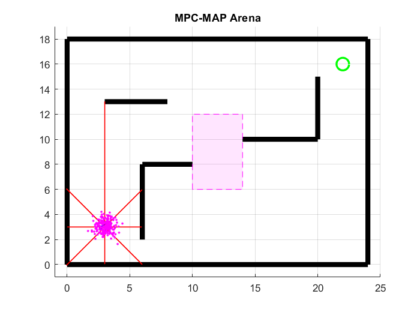
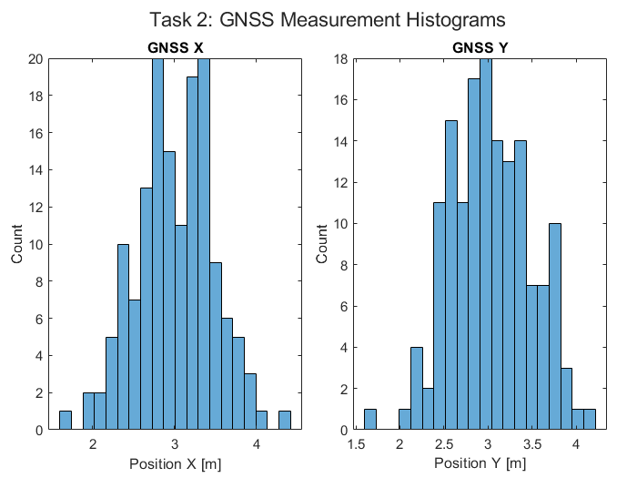
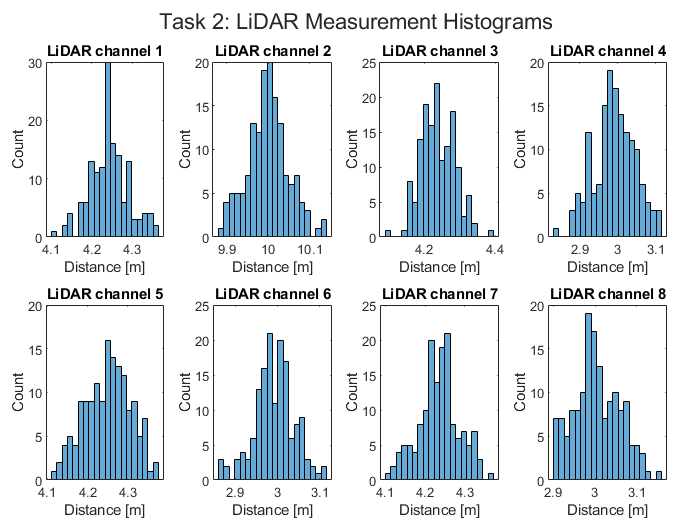
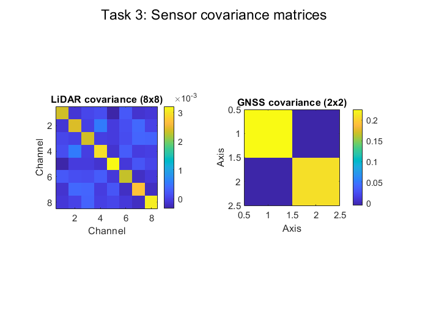
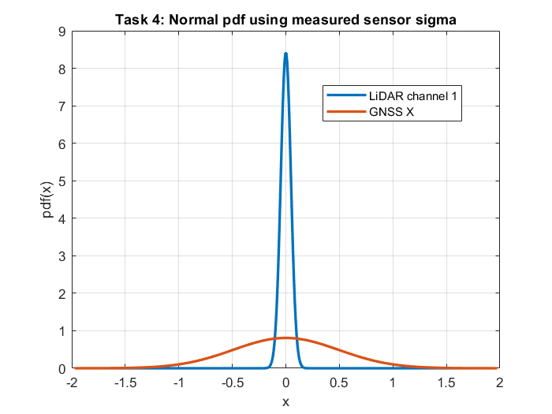
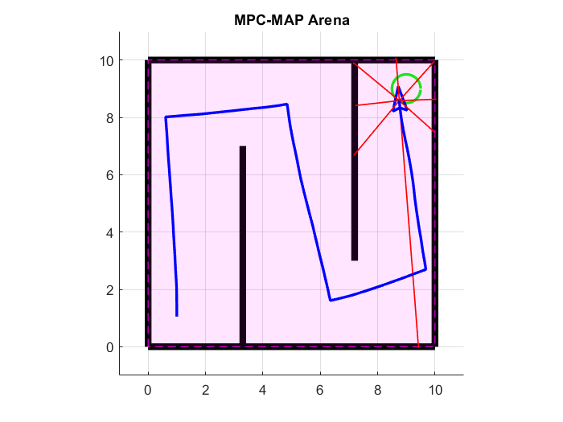

  
  

# MPC-MAP Assignment No. 1 - Report

**Author:** Michal Miškolci  
**Date:** 6. 4. 2026  
## Task 2

For the purpose of this task - new map was created, where the robot has valid data for both Lidar and GNSS. 

*Map = outdoor_bounded_1*

*Measured 150 samples outdoor_bounded_1**

Calculated GNSS sigma:
- x -> 0.4854
- y -> 0.4873

*Measured 150 samples in map = outdoor_bounded_1*

Calculated lidar sigma:
- ch1 -> 0.04956
- ch2 -> 0.04852
- ch3 -> 0.05199 
- ch4 -> 0.05017 
- ch5 -> 0.04857 
- ch6 -> 0.0484 
- ch7 -> 0.05277 
- ch8 -> 0.04658

As seen in the histograms and from data - the std seems pretty consistent accross channels - it difers in 0.0019 for GNSS and 0.00637 for Lidar.

# Task 3

The covariance matrix was assembled for both Lidar and GNSS. The program calculates the sigma^2 from task 2 and compares it to the main diagonal of resultant covariance matrices.

# Task 4

On the normal distribution it is visible that the Lidar measurement is much more reliable than the GNSS.

# Task 5

It was pretty hard to create a sequence of motion commands - the potential sources of uncertanity in real world could be wheel sleepage, manufacturing differences in the motors, gearboxes, wheels, center of mass being situated more on one side.