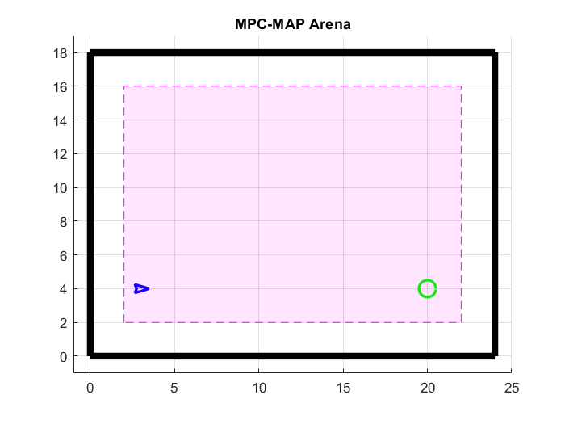
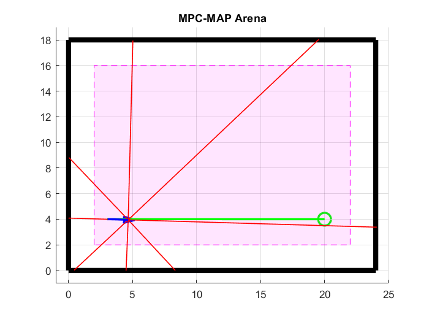
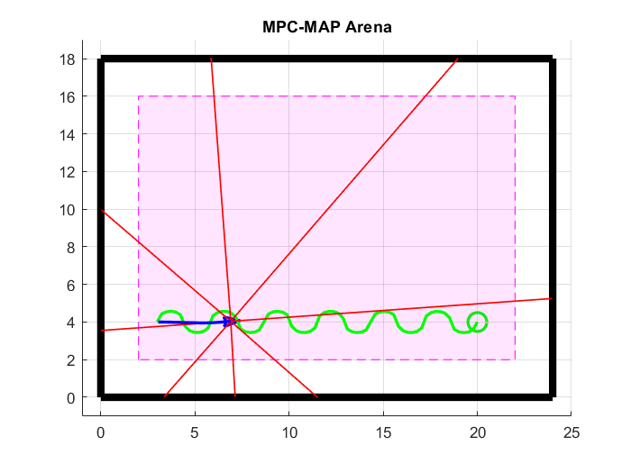
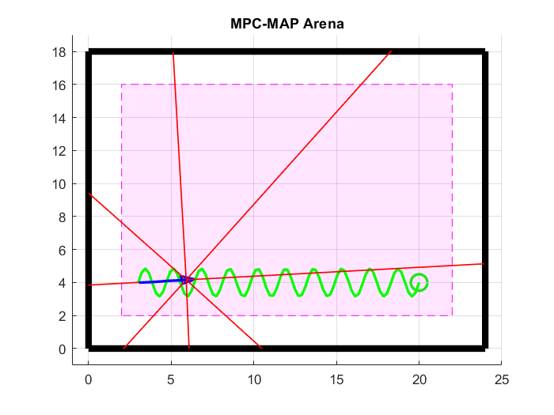

  
  

# MPC-MAP Assignment No. 2 - Report

**Author:** Michal Miškolci  
**Date:** 6. 4. 2026  
## Task 1

A simple spacial map with four walls was created for this task.

## Task 2

Three different paths were created to demonstrate the path following - straight line, circular and sine.

# 