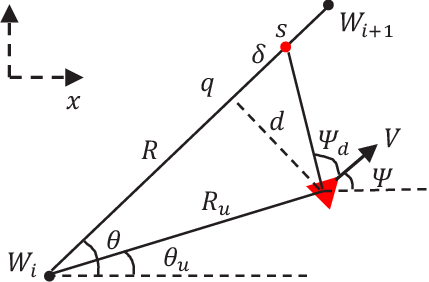
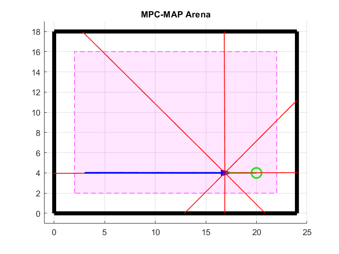
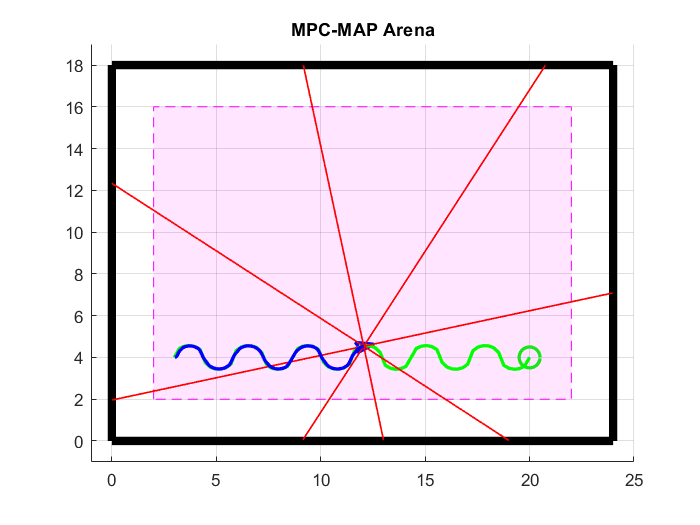
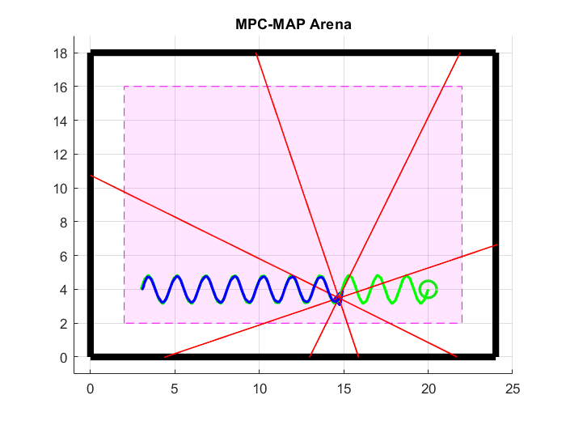

  
  

# MPC-MAP Assignment No. 2 - Report

**Author:** Michal Miškolci  
**Date:** 6. 4. 2026  
## Task 1

A simple spacial map with four walls was created for this task.

## Task 2

Three different paths were created to demonstrate the path following - straight line, circular and sine.

# Task 3

*Tabatabaei, S., Yousefi-Koma, A., Ayati, M., & Mohtasebi, S. (2015). Three dimensional fuzzy carrot-chasing path following algorithm for fixed-wing vehicles. *2015 3rd International Conference on Robotics and Mechatronics (ICRoM)*, 784–788. https://doi.org/10.1109/ICRoM.2015.7367882*

For motion control, a simple carrot-tracking (target point) method was used. The robot always aims at a waypoint in front of its current position and corrects its heading using proportional control. It is easy to implement and works well for the created paths.

The method can be optimized by tuning three parameters: lookahead distance, linear gain, and angular gain. Smaller lookahead - improved path accuracy on curves, larger lookahead - smoother motion. The linear gain affects speed, and the angular gain affects turning aggressiveness, so both should be balanced to avoid oscillation.

