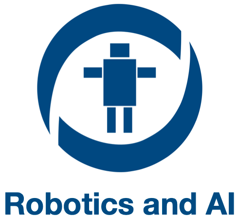
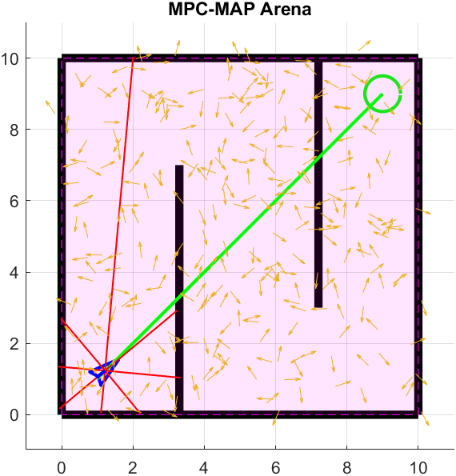
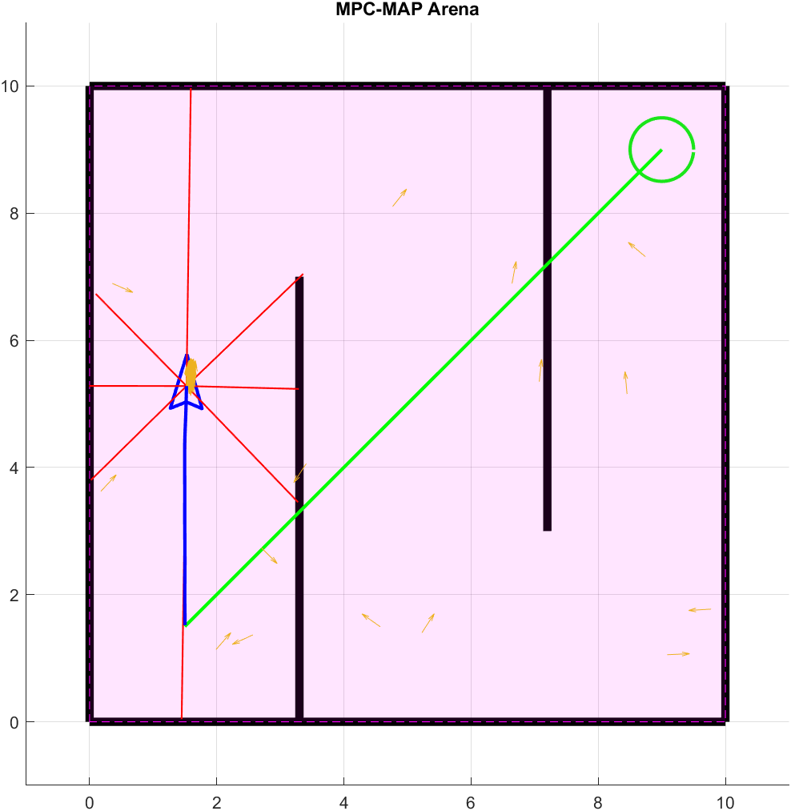

  
  

# MPC-MAP Assignment No. 3 - Report

**Author:** Michal Miškolci  
**Date:** 13. 4. 2026  
## Task 1

I implemented the prediction step in `predict_pose.m` for all particles. The function uses wheel speeds `(v_r, v_l)` and computes linear and angular velocity.

The kinematic model is:

$$
v = \frac{v_r + v_l}{2}, \qquad \omega = \frac{v_r - v_l}{L}
$$

where $L$ is the interwheel distance. The pose is then updated for one time step. The heading angle is normalized to $(-\pi, \pi]$.

## Task 2

I implemented the correction step using two functions: `compute_lidar_measurement.m` and `weight_particles.m`.

For each particle, expected lidar distances are computed by ray casting to map walls and selecting the nearest intersection for each lidar beam.
Particle weights are then computed from the difference between predicted and measured lidar values using a Gaussian likelihood model, followed by normalization.

## Task 3

I implemented low-variance systematic resampling in `resample_particles.m`.
The algorithm samples a random offset $r \in [0, 1/N)$, then evaluates

$$
u_m = r + \frac{m-1}{N}, \quad m=1,\dots,N
$$

and selects particles according to the cumulative sum of normalized weights.

## Task 4

I initialized particles uniformly in the map and updated the particle filter in each iteration using prediction, correction, and resampling.
To improve robustness, I tuned the motion and measurement noise parameters and applied resampling only when the effective sample size dropped below a threshold.

A small fraction of particles is periodically reinitialized to maintain diversity and reduce long-term degeneracy.

The final result is successful localization: particles form a stable cluster around the robot pose while a few exploratory particles remain in the map.

