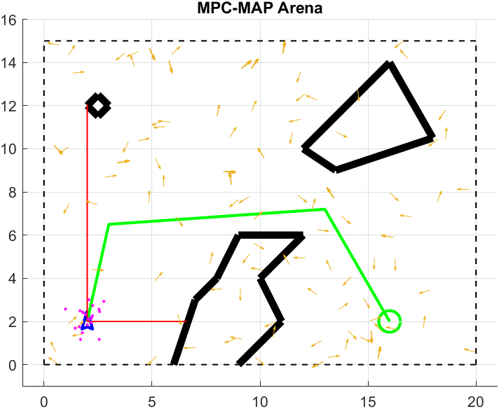

<p align="left">
  
  
</p>

# MPC-MAP Assignment No. 4 - Report

**Author:** Michal Miškolci  
**Date:** 20. 4. 2026  
## Task 1

For Task 1, I loaded the `outdoor_1` map and prepared a manual trajectory from the start pose `[2,2,\pi/2]` to the goal position `[16,2]`.
The trajectory was defined by hand-selected waypoints.



I implemented the initialization procedure for the Kalman filter based on GNSS measurements.

The robot remains stationary at the beginning and collects 80 GNSS samples. From these samples, the initial position mean and covariance matrix are computed and used as the initial belief for the EKF/KF pipeline.

Measured initialization result:

```text
GNSS initialization complete.
Mean: [2.0115 1.9281]
Covariance matrix:
  0.2490   -0.0023
   -0.0023    0.1793
```

The estimated initial position is close to the true start pose, and the covariance matrix captures the GNSS uncertainty in both axes including a small correlation term.

# Task 2

I implemented EKF prediction and KF correction for localization.

The prediction step uses the nonlinear differential-drive model and its Jacobian to propagate the state and covariance. The correction step uses GNSS measurement $z=[x,y]^T$ with linear measurement model $C=[1\ 0\ 0;\ 0\ 1\ 0]$.

From simulator outputs, the corrected estimate $\mu_{corr}$ differs from the predicted estimate $\mu_{pred}$ after GNSS updates, which confirms that the correction step is active.

# Task 3

