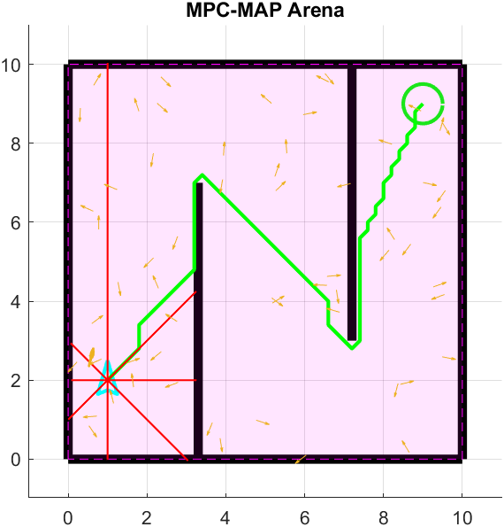
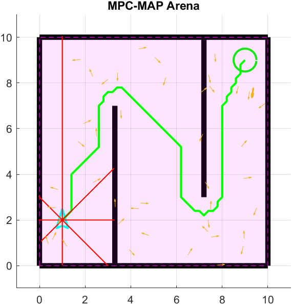
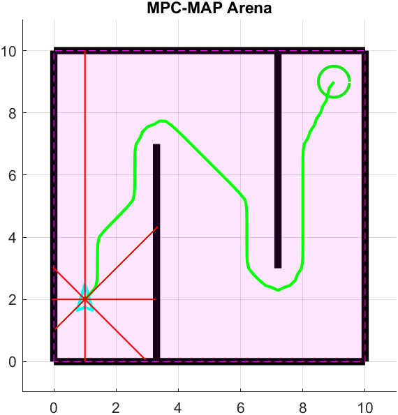

  
  

# MPC-MAP Assignment No. 5 - Report

**Author:** Michal Miškolci  
**Date:** 27. 4. 2026  
## Task 1

I implemented a simple A* search on the occupancy grid stored in `read_only_vars.discrete_map.map`. The open set is ordered by $f(x)=g(x)+h(x)$, where $g(x)$ accumulates the step cost and $h(x)$ is the Euclidean distance to the goal. The algorithm expands 8-connected neighbors, skips occupied cells, and reconstructs the path from the goal back to the start to ensure a collision-free route.

# Task 2

To enforce clearance, I dilated the obstacle cells using a small disk kernel so any path cell stays at least 0.5 m from walls. This keeps the planner simple while guaranteeing a minimum safety margin.

# Task 3

I applied the iterative gradient smoothing update $y_i^{(k+1)} = y_i + \alpha(x_i - y_i) + \beta(y_{i-1} + y_{i+1} - 2y_i)$ to each interior waypoint. The parameters $(\alpha, \beta)$ trade off fidelity to the original path versus smoothness; higher $\alpha$ stays closer to the A* path, while higher $\beta$ produces smoother curves over more iterations.

